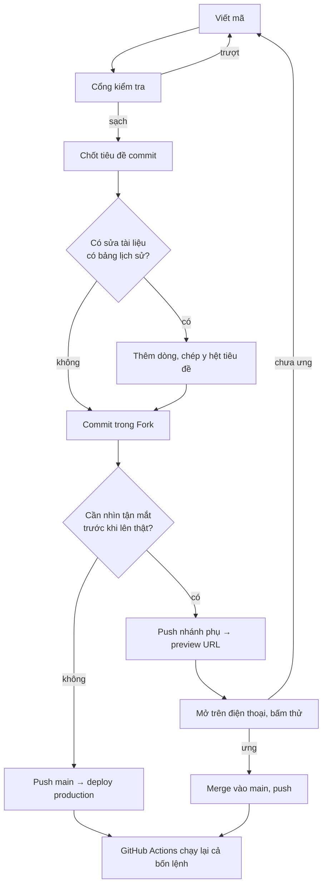

# Quy trình làm việc

> **Tài liệu nội bộ — KHÔNG hiển thị trên web.**
>
> **Lịch sử cập nhật:** xem mục cuối file — mỗi lần sửa thêm một dòng, không ghi đè dòng cũ.

---

## 1. Mô hình: commit thẳng vào `main`

Không nhánh tính năng, không Pull Request. Vercel deploy production mỗi lần `main`
được đẩy lên.

Một người làm thì không có ai review, nên thay chỗ đó là **cổng kiểm tra** ở mục 3 và
**đường quay lui** ở mục 6.

## 2. Ai gõ lệnh gì

| Việc | Ai làm |
|---|---|
| Viết mã, sửa tài liệu, chạy cổng kiểm tra | Claude |
| `pnpm db:generate`, `pnpm db:migrate` trên nhánh **dev** | Claude |
| `git add`, `git commit`, `git push` | Người dùng, trong Fork — **trừ khi nói "commit luôn"** |
| Chạy script đụng vào **production** (baseline, cấp quyền) | Người dùng |

**Mặc định Claude không tự chạy `git commit`, `git push`, `git reset`** — chỉ in nội
dung message ra khối mã để dán vào Fork.

Lý do: commit là lần cuối cùng người làm nhìn thấy toàn bộ thay đổi trước khi nó thành
lịch sử, và trên repo đẩy thẳng vào `main` thì đó là lưới đỡ duy nhất.

**Ngoại lệ: "commit luôn".** Nói đúng câu đó thì Claude tự làm trọn `git add` /
`commit` / `push`. Quy ước đầy đủ ở `.claude/skills/git-commit-messages/SKILL.md`;
tóm tắt bốn ràng buộc:

1. Đọc hết `git status` và `git diff` **trước**, kể cả thay đổi do phiên khác để lại.
2. Chạy đủ bốn lệnh ở mục 3 bên dưới, có `next typegen` đứng đầu.
3. Lệnh nào đỏ thì **dừng**, không commit.
4. Tách commit theo chủ đề, đừng gom hết vào một.

Đánh đổi phải chấp nhận: bỏ đi lần đọc diff của người làm. CI ở
`.github/workflows/ci.yml` gánh phần nào, nhưng nó báo **sau** khi commit đã vào lịch
sử và production đã bắt đầu deploy — nên bốn ràng buộc trên không được bỏ bớt.

## 3. Cổng kiểm tra trước khi commit

```bash
npx tsc --noEmit && pnpm lint && pnpm test && pnpm check:lessons
```

| Lệnh | Bẫy đã biết |
|---|---|
| `tsc --noEmit` | Đổi tên thư mục route thì phải `rm -rf .next` trước — bẫy 5 |
| `pnpm lint` | Phải **sạch tuyệt đối**, không lỗi không cảnh báo. Dòng nào hiện ra cũng là của bạn |
| `pnpm test` | **Đọc dòng `Test Files`, không chỉ dòng `Tests`** — bẫy 3 |
| `pnpm check:lessons` | Chỉ cần khi sửa `docs/03-exercises/` hoặc chỉ thị nhúng bản nhạc |
| `pnpm build` | Chạy cả chuỗi như Vercel — xem ngay dưới |

Rồi `git status`: **`.env.local` phải không xuất hiện**. Khối `AGENTS.md` do `next dev`
sinh ra thì commit kèm, gỡ ra chỉ làm nó hiện lại lần sau.

**Vercel cũng gác một phần.** Lệnh build là:

```
vitest run && drizzle-kit migrate && next build
```

Nên **test đỏ hoặc lỗi kiểu thì deploy không xảy ra**, và test chạy *trước* migrate nên
database còn chưa bị đụng tới. Đã kiểm bằng một test cố ý trượt: build dừng ở
`exit 1`, chuỗi `applying migrations` không xuất hiện lần nào.

Nhưng `pnpm lint` và `pnpm check:lessons` **không** chạy trên Vercel.

**GitHub Actions gác đủ bốn lệnh.** `.github/workflows/ci.yml` chạy `next typegen` →
`tsc --noEmit` → `lint` → `test` → `check:lessons` trên **mọi** lần đẩy nhánh, kể cả
nhánh phụ. Bốn bước cuối để `if: !cancelled()` nên một lần chạy báo về *tất cả* chỗ
hỏng thay vì dừng ở cái đầu tiên — sửa một lượt vẫn rẻ hơn ba vòng đẩy lên chờ kết quả.

`next typegen` là bước bắt buộc chứ không phải trang trí: `next-env.d.ts` nằm trong
`.gitignore` mà nó lại tham chiếu `.next/dev/types/routes.d.ts`, nên trên máy CI vừa
checkout xong thì `tsc --noEmit` chạy một mình sẽ trượt.

**Nhưng CI báo SAU khi đã commit.** Nó bắt được thứ bạn quên, không thay được việc gõ
dòng lệnh ở đầu mục này *trước* khi commit: repo đẩy thẳng `main`, nên lúc CI đỏ thì
commit hỏng đã nằm trong lịch sử và production đã bắt đầu deploy. CI là lưới thứ hai.

## 4. Chốt tiêu đề commit TRƯỚC khi sửa tài liệu

Tám tài liệu trong `docs/` có bảng *Lịch sử cập nhật* chép **y hệt tiêu đề commit**, nên
tiêu đề phải có trước lúc commit:

1. Xong thay đổi, qua cổng kiểm tra.
2. **Nghĩ ra tiêu đề commit.**
3. Thêm một dòng lên **đầu** bảng lịch sử của những tài liệu vừa sửa, dán tiêu đề đó vào.
4. Commit bằng đúng tiêu đề đó.

Message viết **tiếng Việt có dấu**, tiền tố giữ tiếng Anh: `feat:` `fix:` `docs:`
`docs(internal):` `refactor:` `chore:` `style:`. Tìm lại về sau bằng
`git log --grep="<tiêu đề>"`.

## 5. Vòng đời một thay đổi



## 6. Khi production hỏng

1. **Vercel → Deployments → promote bản deploy tốt gần nhất.** Vài giây, không cần git.
   Bấm thử một lần **trước khi có người dùng thật** để lúc cần không phải mò.
2. Bình tĩnh rồi thì `git revert <mã commit>` và push, để lịch sử ghi đúng chuyện đã xảy ra.

Không bao giờ `git reset --hard` rồi force-push `main`.

> [!IMPORTANT]
> **Quay lui chỉ lùi được mã, không lùi được database.** Đó là lý do có quy tắc "chỉ
> được thêm" ở mục 7.

## 7. Đổi cấu trúc bảng

Repo dùng **migration có file**: mỗi lần đổi schema sinh ra một file `.sql` trong
`drizzle/`, commit vào git, và **Vercel tự áp lúc build**. Không còn bước đẩy tay lên
production.

```powershell
# sau khi sửa src/db/schema/*.ts
pnpm db:generate     # sinh drizzle/NNNN_*.sql — MỞ RA ĐỌC
pnpm db:migrate      # áp lên dev
pnpm dev             # bấm thử
```

Rồi commit **kèm file `.sql`** và push. Vercel chạy `drizzle-kit migrate` trong bước
build; migrate trượt thì build trượt và deploy không xảy ra — hỏng theo hướng an toàn,
bản đang chạy vẫn nguyên.

Ba điều bắt buộc:

- **Đọc file `.sql` trước khi commit.** Đây là toàn bộ giá trị của cách làm này.
  `generate` suy ra SQL từ chênh lệch schema, và nó có thể hiểu một lần đổi tên thành
  "xoá cột cũ, thêm cột mới".
- **Không sửa file migration đã push.** Nó đã chạy trên production rồi. Sai thì sinh
  migration mới đè lên.
- **Trong suốt beta, schema chỉ được THÊM**: thêm cột có `DEFAULT`, thêm bảng, thêm
  index. Không xoá cột, không đổi tên, không đổi kiểu. Lý do ở mục 6 — quay lui không
  lùi được database.

Nhớ `$defaultFn` chạy ở tầng Drizzle, **không** tạo `DEFAULT` trong database (bẫy 6);
cột mới `NOT NULL` phải dùng `.defaultNow()` hoặc `.default(...)`.

**Baseline — chỉ làm một lần cho mỗi database.** Database đã có sẵn bảng từ thời dùng
`drizzle-kit push` thì bảng theo dõi migration còn trống, và `migrate` sẽ áp lại từ
`0000` rồi gặp `CREATE TABLE` trên bảng đã tồn tại. Đánh dấu trước:

```powershell
node scripts/baseline-migrations.mjs --through <tag>
```

Script này đọc `.env.local` như mọi script khác, nên mặc định nó nối vào **nhánh dev**.
Baseline production thì thêm cờ `--prod` — nó lấy `POSTGRES_URL_NON_POOLING` có sẵn
trong `.env.local`, khỏi phải dán chuỗi kết nối vào dòng lệnh (dán vào là mật khẩu
production nằm luôn trong lịch sử lệnh của PowerShell):

```powershell
node scripts/baseline-migrations.mjs --prod --through <tag>
```

Vẫn phải **tự đọc dòng `Database :`** nó in ra và xác nhận đúng endpoint production,
trước khi tin phần còn lại.

Chọn sai mốc `--through` là nguy hiểm: đánh dấu cả migration mà database chưa thật sự
có thì thay đổi đó **bị bỏ qua vĩnh viễn** và không ai báo gì cả.

## 8. Khi nào tạo nhánh

Ba trường hợp, ngoài ra commit thẳng `main`:

- Cần **preview URL** để thử trên điện thoại thật.
- **Đụng schema hoặc dữ liệu** — mỗi preview deployment được cấp một nhánh database riêng.
- Việc **kéo dài nhiều buổi** mà chưa chạy được.

```bash
git switch -c feat/ten-viec
git push -u origin feat/ten-viec
# ... xong việc ...
git switch main
git merge feat/ten-viec
git push origin main
git branch -d feat/ten-viec
git push origin --delete feat/ten-viec
```

Xong là **xoá nhánh** — nhánh còn sống là preview còn sống, là một nhánh database lơ lửng.

**Muốn thử ĐĂNG NHẬP trên preview thì đặt tên nhánh là `preview`.** Vercel sinh URL
theo tên nhánh (`<project>-git-<nhánh>-<scope>.vercel.app`), mà Google Cloud Console
không nhận redirect URI có ký tự đại diện — mỗi nhánh một tên là mỗi lần phải thêm một
URI vào danh sách. Dùng đúng một tên nhánh cố định thì khai một lần là xong, và có thể
gán hẳn `preview.rehover.io` cho nhánh đó trong Vercel Domains cho gọn. Nhánh
`feat/...` đặt tên tự do vẫn xem được giao diện, chỉ là không đăng nhập được.

Preview bật Deployment Protection thì mở trên điện thoại sẽ bị hỏi đăng nhập Vercel —
cứ đăng nhập một lần trên trình duyệt đó. **Đừng tắt bảo vệ:** tắt là nội dung chưa
phát hành thành công khai với bất kỳ ai có link.

> [!CAUTION]
> **Trước lần preview đầu tiên, kiểm xem preview đang nối vào database nào.** Lệnh
> build của Vercel có `drizzle-kit migrate`, nên câu trả lời quyết định chuyện một bản
> build preview có áp migration lên **database production** hay không.
>
> Hai cơ chế đang chồng lên nhau, phải biết cái nào thắng: tích hợp Neon đặt
> `DATABASE_URL` cho *All Environments* (bẫy 8), còn tính năng *Create Database Branch
> For Deployment* thì cấp riêng cho mỗi bản preview một nhánh database (bẫy 14). Mở
> Vercel → Settings → Environment Variables xem giá trị của môi trường Preview, và
> Neon Console xem có nhánh nào mọc thêm sau lần deploy preview đầu tiên không.
>
> Bẫy 14 cũng ghi nghi vấn rằng chính tính năng đó đã **xoá nhầm nhánh `dev`**. Dùng
> preview nhiều thì nhớ dấu hiệu nhận biết ở đó: lỗi hiện ra là "sai mật khẩu".

## 9. Không làm

- `git push --force` lên `main`.
- Commit `.env.local`.
- Chạy script đụng database khi chưa biết mình đang trỏ vào nhánh nào.
- Gỡ khối `AGENTS.md` do `next dev` sinh ra khỏi diff.
- Dùng dòng "Cập nhật lần cuối" trong tài liệu — cộng dồn bằng bảng lịch sử.
- Merge vào `main` khi cổng kiểm tra trên GitHub đang đỏ, hoặc tắt nó đi cho nhanh.

---

## Lịch sử cập nhật

> Mỗi lần sửa file thì **thêm một dòng mới lên đầu bảng**, không sửa dòng cũ. Cột
> *Tiêu đề commit* phải chép **y hệt** tiêu đề commit để tìm lại được bằng
> `git log --grep="<tiêu đề>"` hoặc gõ thẳng vào ô tìm kiếm của Fork.

| Ngày | Tiêu đề commit | Cập nhật gì |
|---|---|---|
| 01/09/2026 | `chore: Cho phép Claude tự commit khi được nói "commit luôn"` | Mở ngoại lệ cho quy tắc không tự commit, kèm bốn ràng buộc bắt buộc; ghi rõ đánh đổi là mất lần đọc diff của người làm, và CI chỉ báo sau khi commit đã vào lịch sử |
| 01/09/2026 | `ci: Thêm GitHub Actions gác đủ bốn lệnh kiểm trên mọi lần đẩy` | Mục 3: bốn lệnh của cổng kiểm tra giờ chạy tự động trên GitHub Actions nên bỏ câu "hoàn toàn là kỷ luật của bạn", nhưng ghi rõ CI báo sau khi commit nên không thay được lần gõ tay trước đó; mục 8: chốt tên nhánh `preview` để URL ổn định mà khai redirect URI cho Google đúng một lần, kèm cảnh báo `DATABASE_URL` của môi trường Preview vì build preview có chạy migrate |
| 28/08/2026 | `feat: Baseline trỏ được vào production bằng cờ --prod` | Mục 7: baseline production dùng cờ --prod thay vì dán chuỗi kết nối vào dòng lệnh, vì dán vào là mật khẩu production nằm luôn trong lịch sử lệnh của PowerShell |
| 28/08/2026 | `fix: Dọn sạch lỗi lint và cho Vercel chạy test trước khi deploy` | Cập nhật mục 3: lint giờ sạch tuyệt đối nên bỏ dòng "có sẵn 4 lỗi, không phải bạn gây ra"; ghi rõ Vercel gác được test và kiểu nhưng KHÔNG gác lint với check:lessons, để khỏi tưởng đã có máy lo hết |
| 28/08/2026 | `feat: Đổi schema bằng migration có file thay vì drizzle-kit push` | Viết lại mục 7: chuyển từ `drizzle-kit push` sang `generate` + `migrate`, Vercel tự áp lúc build nên bỏ hẳn bước đẩy schema lên production bằng tay; thêm phần baseline cho database đã có bảng từ trước |
| 28/08/2026 | `docs(internal): Đặc tả quy trình làm việc với git` | Tạo file — chốt mô hình commit thẳng vào `main`, ranh giới việc nào Claude làm việc nào người dùng làm trong Fork, cổng kiểm tra trước commit, đường quay lui khi production hỏng, và quy tắc schema chỉ được thêm trong suốt beta vì quay lui không lùi được database |
