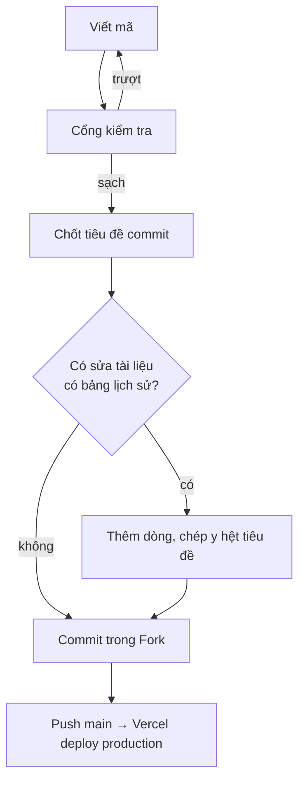

# Quy trình làm việc

> **Tài liệu nội bộ — KHÔNG hiển thị trên web.**
>
> **Lịch sử cập nhật:** xem mục cuối file — mỗi lần sửa thêm một dòng, không ghi đè dòng cũ.

---

## 1. Mô hình: commit thẳng vào `main`

Không nhánh tính năng, không Pull Request. Vercel deploy production mỗi lần `main`
được đẩy lên.

Một người làm thì không có ai review, nên thay chỗ đó là **cổng kiểm tra** ở mục 3 và
**đường quay lui** ở mục 6.

## 2. Ai gõ lệnh gì

| Việc | Ai làm |
|---|---|
| Viết mã, sửa tài liệu, chạy cổng kiểm tra | Claude |
| `pnpm db:push` lên nhánh **dev** | Claude |
| `git add`, `git commit`, `git push` | Người dùng, trong Fork |
| `pnpm db:push` lên **production** | Người dùng |

**Claude không tự chạy `git commit`, `git push`, `git reset`** — chỉ in nội dung message
ra khối mã để dán vào Fork. Quy ước ở `.claude/skills/git-commit-messages/SKILL.md`.

Lý do: commit là lần cuối cùng người làm nhìn thấy toàn bộ thay đổi trước khi nó thành
lịch sử, và trên repo đẩy thẳng vào `main` thì đó là lưới đỡ duy nhất.

## 3. Cổng kiểm tra trước khi commit

```bash
npx tsc --noEmit && pnpm lint && pnpm test && pnpm check:lessons
```

| Lệnh | Bẫy đã biết |
|---|---|
| `tsc --noEmit` | Đổi tên thư mục route thì phải `rm -rf .next` trước — bẫy 5 |
| `pnpm lint` | Đã có sẵn 4 lỗi `no-explicit-any` trong `MarkdownViewer.tsx`, không phải bạn vừa gây ra |
| `pnpm test` | **Đọc dòng `Test Files`, không chỉ dòng `Tests`** — bẫy 3 |
| `pnpm check:lessons` | Chỉ cần khi sửa `docs/03-exercises/` hoặc chỉ thị nhúng bản nhạc |
| `pnpm build` | Chạy thêm khi đụng cấu hình hay route — bắt lỗi Server Component mà `tsc` không thấy |

Rồi `git status`: **`.env.local` phải không xuất hiện**. Khối `AGENTS.md` do `next dev`
sinh ra thì commit kèm, gỡ ra chỉ làm nó hiện lại lần sau.

## 4. Chốt tiêu đề commit TRƯỚC khi sửa tài liệu

Tám tài liệu trong `docs/` có bảng *Lịch sử cập nhật* chép **y hệt tiêu đề commit**, nên
tiêu đề phải có trước lúc commit:

1. Xong thay đổi, qua cổng kiểm tra.
2. **Nghĩ ra tiêu đề commit.**
3. Thêm một dòng lên **đầu** bảng lịch sử của những tài liệu vừa sửa, dán tiêu đề đó vào.
4. Commit bằng đúng tiêu đề đó.

Message viết **tiếng Việt có dấu**, tiền tố giữ tiếng Anh: `feat:` `fix:` `docs:`
`docs(internal):` `refactor:` `chore:` `style:`. Tìm lại về sau bằng
`git log --grep="<tiêu đề>"`.

## 5. Vòng đời một thay đổi



## 6. Khi production hỏng

1. **Vercel → Deployments → promote bản deploy tốt gần nhất.** Vài giây, không cần git.
   Bấm thử một lần **trước khi có người dùng thật** để lúc cần không phải mò.
2. Bình tĩnh rồi thì `git revert <mã commit>` và push, để lịch sử ghi đúng chuyện đã xảy ra.

Không bao giờ `git reset --hard` rồi force-push `main`.

> [!IMPORTANT]
> **Quay lui chỉ lùi được mã, không lùi được database.** Đó là lý do có quy tắc "chỉ
> được thêm" ở mục 7.

## 7. Đổi cấu trúc bảng

Repo dùng `drizzle-kit push`, **không có file migration** (`/drizzle` bị `.gitignore`
chặn). Không có bản ghi và không có đường lùi tự động.

Thứ tự: sửa schema → `pnpm db:push` vào **dev** → kiểm lại cột → chạy thử → mới tới
production. Nếu mã sắp deploy có **đọc** cột mới thì phải đẩy schema lên production
**trước** khi push mã.

```powershell
$env:DATABASE_URL_UNPOOLED='<chuỗi kết nối TRỰC TIẾP nhánh main>'; pnpm db:push
Remove-Item Env:DATABASE_URL_UNPOOLED
```

Ba chỗ hỏng, cả ba đều **không báo lỗi**:

- Đặt nhầm `DATABASE_URL` thay vì `DATABASE_URL_UNPOOLED` → lệnh lại chạy vào dev.
- Quên `Remove-Item` → lần `db:push` sau, kể cả cho việc khác, vào thẳng production.
- Cột mới `NOT NULL` không có `DEFAULT` → trượt, hoặc drizzle đề nghị xoá dữ liệu.
  Nhớ `$defaultFn` không tạo default trong database — bẫy 6.

**Trong suốt beta, schema chỉ được THÊM:** thêm cột có `DEFAULT`, thêm bảng, thêm index.
Không xoá cột, không đổi tên, không đổi kiểu. Muốn đổi tên thì thêm cột mới, cho mã ghi
cả hai, hết beta mới xoá cột cũ.

## 8. Khi nào tạo nhánh

Ba trường hợp, ngoài ra commit thẳng `main`:

- Cần **preview URL** để thử trên điện thoại thật.
- **Đụng schema hoặc dữ liệu** — mỗi preview deployment được cấp một nhánh database riêng.
- Việc **kéo dài nhiều buổi** mà chưa chạy được.

```bash
git switch -c feat/ten-viec
git push -u origin feat/ten-viec
# ... xong việc ...
git switch main
git merge feat/ten-viec
git push origin main
git branch -d feat/ten-viec
git push origin --delete feat/ten-viec
```

Xong là **xoá nhánh** — nhánh còn sống là preview còn sống, là một nhánh database lơ lửng.

## 9. Không làm

- `git push --force` lên `main`.
- Commit `.env.local`.
- `pnpm db:push` khi chưa biết mình đang trỏ vào đâu.
- Gỡ khối `AGENTS.md` do `next dev` sinh ra khỏi diff.
- Dùng dòng "Cập nhật lần cuối" trong tài liệu — cộng dồn bằng bảng lịch sử.

---

## Lịch sử cập nhật

> Mỗi lần sửa file thì **thêm một dòng mới lên đầu bảng**, không sửa dòng cũ. Cột
> *Tiêu đề commit* phải chép **y hệt** tiêu đề commit để tìm lại được bằng
> `git log --grep="<tiêu đề>"` hoặc gõ thẳng vào ô tìm kiếm của Fork.

| Ngày | Tiêu đề commit | Cập nhật gì |
|---|---|---|
| 28/08/2026 | `docs(internal): Đặc tả quy trình làm việc với git` | Tạo file — chốt mô hình commit thẳng vào `main`, ranh giới việc nào Claude làm việc nào người dùng làm trong Fork, cổng kiểm tra trước commit, đường quay lui khi production hỏng, và quy tắc schema chỉ được thêm trong suốt beta vì quay lui không lùi được database |
