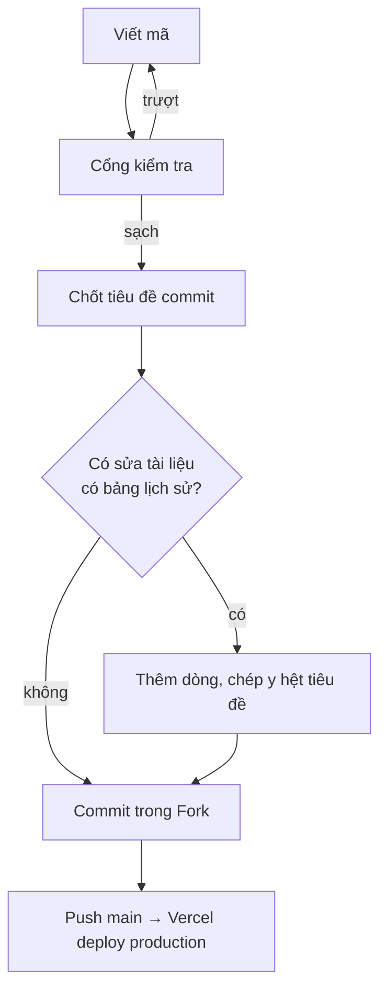

# Quy trình làm việc

> **Tài liệu nội bộ — KHÔNG hiển thị trên web.**
>
> **Lịch sử cập nhật:** xem mục cuối file — mỗi lần sửa thêm một dòng, không ghi đè dòng cũ.

---

## 1. Mô hình: commit thẳng vào `main`

Không nhánh tính năng, không Pull Request. Vercel deploy production mỗi lần `main`
được đẩy lên.

Một người làm thì không có ai review, nên thay chỗ đó là **cổng kiểm tra** ở mục 3 và
**đường quay lui** ở mục 6.

## 2. Ai gõ lệnh gì

| Việc | Ai làm |
|---|---|
| Viết mã, sửa tài liệu, chạy cổng kiểm tra | Claude |
| `pnpm db:generate`, `pnpm db:migrate` trên nhánh **dev** | Claude |
| `git add`, `git commit`, `git push` | Người dùng, trong Fork |
| Chạy script đụng vào **production** (baseline, cấp quyền) | Người dùng |

**Claude không tự chạy `git commit`, `git push`, `git reset`** — chỉ in nội dung message
ra khối mã để dán vào Fork. Quy ước ở `.claude/skills/git-commit-messages/SKILL.md`.

Lý do: commit là lần cuối cùng người làm nhìn thấy toàn bộ thay đổi trước khi nó thành
lịch sử, và trên repo đẩy thẳng vào `main` thì đó là lưới đỡ duy nhất.

## 3. Cổng kiểm tra trước khi commit

```bash
npx tsc --noEmit && pnpm lint && pnpm test && pnpm check:lessons
```

| Lệnh | Bẫy đã biết |
|---|---|
| `tsc --noEmit` | Đổi tên thư mục route thì phải `rm -rf .next` trước — bẫy 5 |
| `pnpm lint` | Phải **sạch tuyệt đối**, không lỗi không cảnh báo. Dòng nào hiện ra cũng là của bạn |
| `pnpm test` | **Đọc dòng `Test Files`, không chỉ dòng `Tests`** — bẫy 3 |
| `pnpm check:lessons` | Chỉ cần khi sửa `docs/03-exercises/` hoặc chỉ thị nhúng bản nhạc |
| `pnpm build` | Chạy cả chuỗi như Vercel — xem ngay dưới |

Rồi `git status`: **`.env.local` phải không xuất hiện**. Khối `AGENTS.md` do `next dev`
sinh ra thì commit kèm, gỡ ra chỉ làm nó hiện lại lần sau.

**Vercel cũng gác một phần.** Lệnh build là:

```
vitest run && drizzle-kit migrate && next build
```

Nên **test đỏ hoặc lỗi kiểu thì deploy không xảy ra**, và test chạy *trước* migrate nên
database còn chưa bị đụng tới. Đã kiểm bằng một test cố ý trượt: build dừng ở
`exit 1`, chuỗi `applying migrations` không xuất hiện lần nào.

Nhưng `pnpm lint` và `pnpm check:lessons` **không** chạy trên Vercel. Hai cái đó vẫn
hoàn toàn là kỷ luật của bạn — đó là lý do dòng lệnh ở đầu mục này vẫn cần gõ tay.

## 4. Chốt tiêu đề commit TRƯỚC khi sửa tài liệu

Tám tài liệu trong `docs/` có bảng *Lịch sử cập nhật* chép **y hệt tiêu đề commit**, nên
tiêu đề phải có trước lúc commit:

1. Xong thay đổi, qua cổng kiểm tra.
2. **Nghĩ ra tiêu đề commit.**
3. Thêm một dòng lên **đầu** bảng lịch sử của những tài liệu vừa sửa, dán tiêu đề đó vào.
4. Commit bằng đúng tiêu đề đó.

Message viết **tiếng Việt có dấu**, tiền tố giữ tiếng Anh: `feat:` `fix:` `docs:`
`docs(internal):` `refactor:` `chore:` `style:`. Tìm lại về sau bằng
`git log --grep="<tiêu đề>"`.

## 5. Vòng đời một thay đổi



## 6. Khi production hỏng

1. **Vercel → Deployments → promote bản deploy tốt gần nhất.** Vài giây, không cần git.
   Bấm thử một lần **trước khi có người dùng thật** để lúc cần không phải mò.
2. Bình tĩnh rồi thì `git revert <mã commit>` và push, để lịch sử ghi đúng chuyện đã xảy ra.

Không bao giờ `git reset --hard` rồi force-push `main`.

> [!IMPORTANT]
> **Quay lui chỉ lùi được mã, không lùi được database.** Đó là lý do có quy tắc "chỉ
> được thêm" ở mục 7.

## 7. Đổi cấu trúc bảng

Repo dùng **migration có file**: mỗi lần đổi schema sinh ra một file `.sql` trong
`drizzle/`, commit vào git, và **Vercel tự áp lúc build**. Không còn bước đẩy tay lên
production.

```powershell
# sau khi sửa src/db/schema/*.ts
pnpm db:generate     # sinh drizzle/NNNN_*.sql — MỞ RA ĐỌC
pnpm db:migrate      # áp lên dev
pnpm dev             # bấm thử
```

Rồi commit **kèm file `.sql`** và push. Vercel chạy `drizzle-kit migrate` trong bước
build; migrate trượt thì build trượt và deploy không xảy ra — hỏng theo hướng an toàn,
bản đang chạy vẫn nguyên.

Ba điều bắt buộc:

- **Đọc file `.sql` trước khi commit.** Đây là toàn bộ giá trị của cách làm này.
  `generate` suy ra SQL từ chênh lệch schema, và nó có thể hiểu một lần đổi tên thành
  "xoá cột cũ, thêm cột mới".
- **Không sửa file migration đã push.** Nó đã chạy trên production rồi. Sai thì sinh
  migration mới đè lên.
- **Trong suốt beta, schema chỉ được THÊM**: thêm cột có `DEFAULT`, thêm bảng, thêm
  index. Không xoá cột, không đổi tên, không đổi kiểu. Lý do ở mục 6 — quay lui không
  lùi được database.

Nhớ `$defaultFn` chạy ở tầng Drizzle, **không** tạo `DEFAULT` trong database (bẫy 6);
cột mới `NOT NULL` phải dùng `.defaultNow()` hoặc `.default(...)`.

**Baseline — chỉ làm một lần cho mỗi database.** Database đã có sẵn bảng từ thời dùng
`drizzle-kit push` thì bảng theo dõi migration còn trống, và `migrate` sẽ áp lại từ
`0000` rồi gặp `CREATE TABLE` trên bảng đã tồn tại. Đánh dấu trước:

```powershell
node scripts/baseline-migrations.mjs --through <tag>
```

Script này đọc `.env.local` như mọi script khác, nên nó nối vào **nhánh dev**. Muốn
baseline production thì đặt biến đè lên, và nhớ xoá đi ngay sau đó — bẫy 12:

```powershell
$env:DATABASE_URL='<chuỗi kết nối nhánh main>'; node scripts/baseline-migrations.mjs --through <tag>
Remove-Item Env:DATABASE_URL
```

Chọn sai mốc `--through` là nguy hiểm: đánh dấu cả migration mà database chưa thật sự
có thì thay đổi đó **bị bỏ qua vĩnh viễn** và không ai báo gì cả.

## 8. Khi nào tạo nhánh

Ba trường hợp, ngoài ra commit thẳng `main`:

- Cần **preview URL** để thử trên điện thoại thật.
- **Đụng schema hoặc dữ liệu** — mỗi preview deployment được cấp một nhánh database riêng.
- Việc **kéo dài nhiều buổi** mà chưa chạy được.

```bash
git switch -c feat/ten-viec
git push -u origin feat/ten-viec
# ... xong việc ...
git switch main
git merge feat/ten-viec
git push origin main
git branch -d feat/ten-viec
git push origin --delete feat/ten-viec
```

Xong là **xoá nhánh** — nhánh còn sống là preview còn sống, là một nhánh database lơ lửng.

## 9. Không làm

- `git push --force` lên `main`.
- Commit `.env.local`.
- Chạy script đụng database khi chưa biết mình đang trỏ vào nhánh nào.
- Gỡ khối `AGENTS.md` do `next dev` sinh ra khỏi diff.
- Dùng dòng "Cập nhật lần cuối" trong tài liệu — cộng dồn bằng bảng lịch sử.

---

## Lịch sử cập nhật

> Mỗi lần sửa file thì **thêm một dòng mới lên đầu bảng**, không sửa dòng cũ. Cột
> *Tiêu đề commit* phải chép **y hệt** tiêu đề commit để tìm lại được bằng
> `git log --grep="<tiêu đề>"` hoặc gõ thẳng vào ô tìm kiếm của Fork.

| Ngày | Tiêu đề commit | Cập nhật gì |
|---|---|---|
| 28/08/2026 | `fix: Dọn sạch lỗi lint và cho Vercel chạy test trước khi deploy` | Cập nhật mục 3: lint giờ sạch tuyệt đối nên bỏ dòng "có sẵn 4 lỗi, không phải bạn gây ra"; ghi rõ Vercel gác được test và kiểu nhưng KHÔNG gác lint với check:lessons, để khỏi tưởng đã có máy lo hết |
| 28/08/2026 | `feat: Đổi schema bằng migration có file thay vì drizzle-kit push` | Viết lại mục 7: chuyển từ `drizzle-kit push` sang `generate` + `migrate`, Vercel tự áp lúc build nên bỏ hẳn bước đẩy schema lên production bằng tay; thêm phần baseline cho database đã có bảng từ trước |
| 28/08/2026 | `docs(internal): Đặc tả quy trình làm việc với git` | Tạo file — chốt mô hình commit thẳng vào `main`, ranh giới việc nào Claude làm việc nào người dùng làm trong Fork, cổng kiểm tra trước commit, đường quay lui khi production hỏng, và quy tắc schema chỉ được thêm trong suốt beta vì quay lui không lùi được database |
